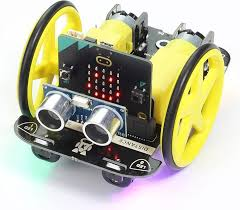

# Projet robotique
option complémentaire en informatique du gymnase du Bugnon

## Description
Dans ce projet nous programmons le robot Kitronik MOVE

## Partie obligatoire
Dans ce mini-projet le robot

- commence le parcours à une position A
- va suivre une ligne
- va detecter un objet avec le capteur ultrason (position B variable)
- va tourner de 180°
- va attraper l'objet avec la pince
- va ramener l'objet à la positon A

## Partie libre
Vous êtes complêtement libre de faire quelque chose avec le robot

- une danse
- un light-show
- parler faire de la musique
- être télécommandé
- etc.

## Documentation
Toute la documentation se trouve dans ce fichier README.md Vous devez utiliser

## 3 niveau de titres
- liste avec puces et numéroté
- des examples de code
- des formules mathématiques
- des images
- des hyperliens

set_all(color) -essayer
